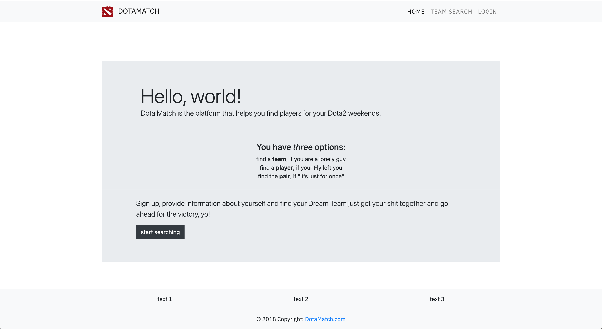
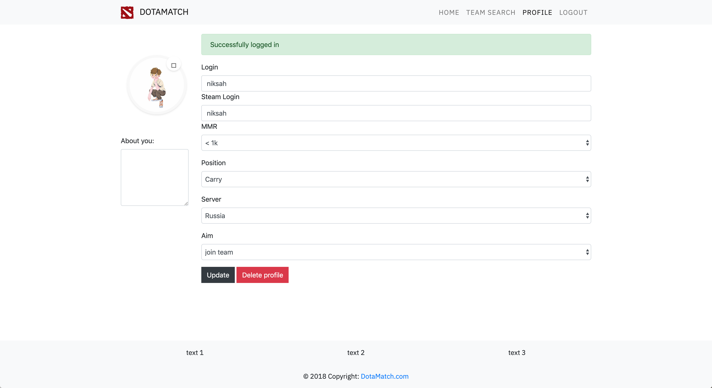
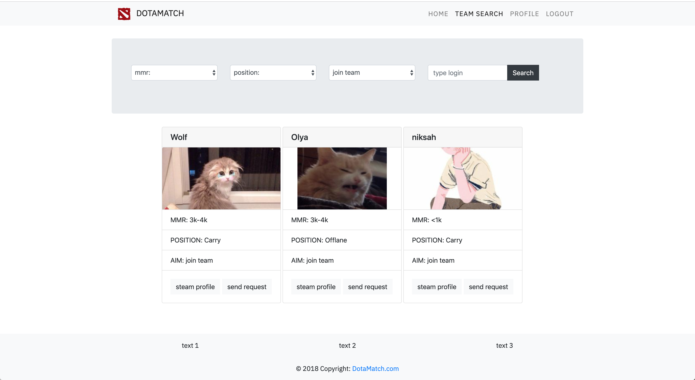

# Final project for HSE "inro to social app development" course

Simple web app, where you can find a teammate for your dota 2 sessions by some criterion

# Team

[Ekaterina Marchenko](https://github.com/eyumarchenko) - templates, html, css, ideas        
[Alexander Nikulin](https://github.com/Howuhh) - flask, db, python     

# Main

# Login & profile

# Search

 